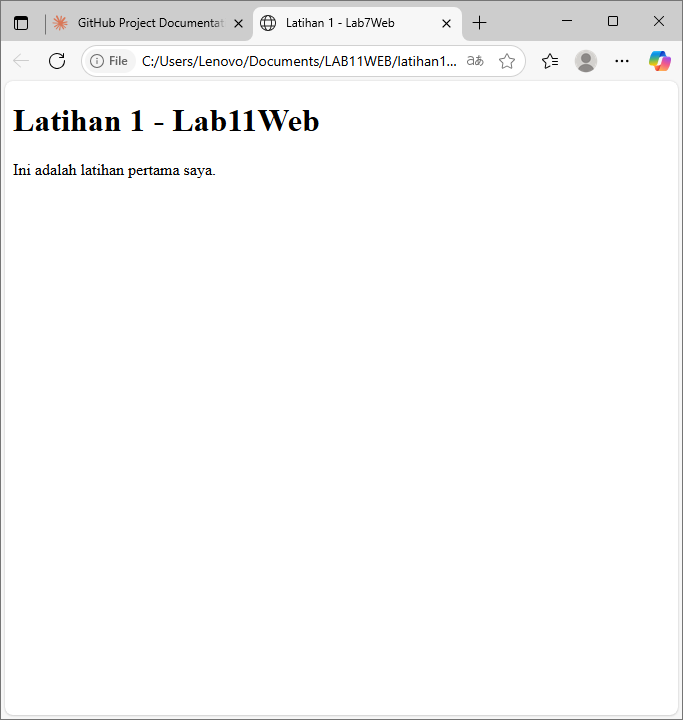

#Praktikum one,too,three
# Lab11Web - Praktikum Pemrograman Web

## Informasi Praktikum
- **Nama**: [Dede Syifa Sifriani]
- **NIM**: [312310372]
- **Kelas**: [TI.23.C2]

## Latihan 1: HTML dan CSS Dasar

### Langkah 1: Membuat File HTML
Saya membuat file `index.html` dengan struktur HTML dasar.

### Langkah 2: Menambahkan CSS
Saya membuat file `style.css` untuk styling halaman.

#### Praktikum 1: PHP Framework (CodeIgniter 4)

## Tujuan Praktikum
1. Mahasiswa mampu memahami konsep dasar Framework
2. Mahasiswa mampu memahami konsep dasar MVC
3. Mahasiswa mampu membuat program sederhana menggunakan Framework CodeIgniter 4

## Persiapan

### Tools yang Dibutuhkan
1. Text editor (VSCode)
2. XAMPP Web Server
3. Browser

### Langkah Persiapan
1. Buat folder baru dengan nama `lab11_php_ci` pada docroot webserver (htdocs)
2. Pastikan ekstensi PHP sudah aktif

## Langkah 1: Konfigurasi PHP Extensions

### Ekstensi yang Perlu Diaktifkan:
- `php-json` - untuk bekerja dengan JSON
- `php-mysqlnd` - native driver untuk MySQL
- `php-xml` - untuk bekerja dengan XML
- `php-intl` - untuk aplikasi multibahasa
- `libcurl` - (opsional) untuk Curl

### Cara Mengaktifkan:
1. Buka XAMPP Control Panel
2. Pada bagian Apache, klik **Config** → **PHP.ini**
3. Cari bagian `extension`, hilangkan tanda `;` (titik koma) pada ekstensi yang akan diaktifkan:
   ```ini
   extension=json
   extension=mysqlnd
   extension=xml
   extension=intl
   extension=curl
   ```
4. Simpan file dan restart Apache web server

## Langkah 2: Instalasi CodeIgniter 4

### Download dan Setup:
1. Unduh CodeIgniter dari https://codeigniter.com/download
2. Extract file zip ke direktori `htdocs/lab11_ci`
3. Ubah nama direktori `framework-4.x.xx` menjadi `ci4`
4. Test instalasi dengan membuka browser: `http://localhost/lab11_ci/ci4/public/`

### Struktur Direktori Penting:
```
ci4/
├── app/           # Kode aplikasi yang dikembangkan
├── public/        # File yang bisa diakses publik (index.php, css, js, dll)
├── vendor/        # Library yang dibutuhkan aplikasi
├── writable/      # File yang ditulis aplikasi (upload, logs, session)
└── .env           # Variabel environment
```

## Langkah 3: Menjalankan CLI (Command Line Interface)

### Setup CLI:
1. Buka terminal/command prompt
2. Arahkan ke direktori project: `xampp/htdocs/lab11_ci/ci4/`
3. Jalankan perintah: `php spark`

### Perintah CLI Berguna:
```bash
php spark                    # Menampilkan daftar perintah
php spark routes            # Menampilkan semua route
php spark serve             # Menjalankan development server
```

## Langkah 4: Mengaktifkan Mode Debugging

### Cara Mengaktifkan:
1. Ubah nama file `env` menjadi `.env`
2. Buka file `.env`
3. Ubah nilai variable:
   ```
   CI_ENVIRONMENT = development
   ```
4. Simpan file

### Test Error Handling:
- Coba buat error dengan menghilangkan titik koma di `app/Controllers/Home.php`
- Refresh browser untuk melihat error detail

## Langkah 5: Memahami Konsep MVC

### Model-View-Controller:
- **Model**: Pemodelan data (database, API, dll)
- **View**: Tampilan user interface (HTML, CSS)
- **Controller**: Logic proses yang menghubungkan Model dan View

### Alur Request:
```
Request → Router → Controller → Model/View → Response
```

## Langkah 6: Routing dan Controller

### Membuat Route Baru:
1. Buka file `app/Config/Routes.php`
2. Tambahkan route baru:
   ```php
   $routes->get('/about', 'Page::about');
   $routes->get('/contact', 'Page::contact');
   $routes->get('/faqs', 'Page::faqs');
   ```

### Cek Route:
```bash
php spark routes
```

## Langkah 7: Membuat Controller

### Buat Controller Page:
1. Buat file `app/Controllers/Page.php`
2. Isi dengan kode:
   ```php
   <?php
   namespace App\Controllers;
   
   class Page extends BaseController
   {
       public function about()
       {
           echo "Ini halaman About";
       }
   
       public function contact()
       {
           echo "Ini halaman Contact";
       }
   
       public function faqs()
       {
           echo "Ini halaman FAQ";
       }
   }
   ```

### Test Controller:
- Akses: `http://localhost:8080/about`
- Akses: `http://localhost:8080/contact`
- Akses: `http://localhost:8080/faqs`

## Langkah 8: Auto Routing

### Menggunakan Auto Route:
1. Pastikan auto route aktif di `Routes.php`:
   ```php
   $routes->setAutoRoute(true);
   ```

2. Tambah method baru di Controller Page:
   ```php
   public function tos()
   {
       echo "Ini halaman Terms of Services";
   }
   ```

3. Akses dengan: `http://localhost:8080/page/tos`

## Langkah 9: Membuat View

### Buat File View:
1. Buat file `app/Views/about.php`
2. Isi dengan kode:
   ```php
   <!DOCTYPE html>
   <html lang="en">
   <head>
       <meta charset="UTF-8">
       <title><?= $title; ?></title>
   </head>
   <body>
       <h1><?= $title; ?></h1>
       <hr>
       <p><?= $content; ?></p>
   </body>
   </html>
   ```

### Update Controller:
```php
public function about()
{
    return view('about', [
        'title' => 'Halaman About',
        'content' => 'Ini adalah halaman about yang menjelaskan tentang isi halaman ini.'
    ]);
}
```

## Langkah 10: Membuat Layout dengan CSS

### Setup CSS:
1. Copy file CSS dari praktikum sebelumnya ke `public/style.css`
2. Buat folder `app/Views/template/`

### Buat Header Template:
File: `app/Views/template/header.php`
```php
<!DOCTYPE html>
<html lang="en">
<head>
    <meta charset="UTF-8">
    <title><?= $title; ?></title>
    <link rel="stylesheet" href="<?= base_url('/style.css');?>">
</head>
<body>
    <div id="container">
        <header>
            <h1>Layout Sederhana</h1>
        </header>
        <nav>
            <a href="<?= base_url('/');?>" class="active">Home</a>
            <a href="<?= base_url('/artikel');?>">Artikel</a>
            <a href="<?= base_url('/about');?>">About</a>
            <a href="<?= base_url('/contact');?>">Kontak</a>
        </nav>
        <section id="wrapper">
            <section id="main">
```

### Buat Footer Template:
File: `app/Views/template/footer.php`
```php
            </section>
            <aside id="sidebar">
                <div class="widget-box">
                    <h3 class="title">Widget Header</h3>
                    <ul>
                        <li><a href="#">Widget Link</a></li>
                        <li><a href="#">Widget Link</a></li>
                    </ul>
                </div>
                <div class="widget-box">
                    <h3 class="title">Widget Text</h3>
                    <p>Vestibulum lorem elit, iaculis in nisl volutpat, malesuada tincidunt arcu. Proin in leo fringilla, vestibulum mi porta, faucibus felis.</p>
                </div>
            </aside>
        </section>
        <footer>
            <p>&copy; 2021 - Universitas Pelita Bangsa</p>
        </footer>
    </div>
</body>
</html>
```

### Update View About:
File: `app/Views/about.php`
```php
<?= $this->include('template/header'); ?>

<h1><?= $title; ?></h1>
<hr>
<p><?= $content; ?></p>

<?= $this->include('template/footer'); ?>
```

## Tugas

### Lengkapi Menu Lainnya:
1. Buat view untuk `contact.php` dan `faqs.php`
2. Update method di Controller Page untuk menggunakan view
3. Pastikan semua link navigasi berfungsi dengan layout yang sama

### Contoh untuk Contact:
```php
// Di Controller Page
public function contact()
{
    return view('contact', [
        'title' => 'Halaman Kontak',
        'content' => 'Ini adalah halaman kontak untuk menghubungi kami.'
    ]);
}
```

```php
// File app/Views/contact.php
<?= $this->include('template/header'); ?>

<h1><?= $title; ?></h1>
<hr>
<p><?= $content; ?></p>

<?= $this->include('template/footer'); ?>
```

## Tips Debugging

### Error Umum:
1. **404 Not Found**: Controller atau method tidak ditemukan
2. **500 Internal Server Error**: Syntax error dalam kode
3. **CSS tidak load**: Periksa path di `base_url()`

### Perintah Berguna:
```bash
php spark routes          # Cek semua route
php spark serve          # Run development server
php spark cache:clear    # Clear cache
```
---
### Hasil:
[Screenshot hasil ada disetiap latihan]

## Latihan 2: []
[# Praktikum 2: Framework Lanjutan (CRUD) - CodeIgniter 4

## 📋 Tujuan Praktikum

1. Memahami konsep dasar Model dalam CodeIgniter 4
2. Memahami konsep dasar CRUD (Create, Read, Update, Delete)
3. Membuat program sederhana menggunakan Framework CodeIgniter 4

## 🛠️ Persiapan

### Tools yang Dibutuhkan:
- Text Editor (VSCode)
- XAMPP (MySQL Server)
- Web Browser
- CodeIgniter 4

### Struktur Folder:
```
lab7_php_ci/
├── app/
│   ├── Controllers/
│   ├── Models/
│   ├── Views/
│   └── Config/
├── public/
└── .env
```

## 📊 Database Setup

### 1. Membuat Database
```sql
CREATE DATABASE lab_ci4;
```

### 2. Membuat Tabel Artikel
```sql
CREATE TABLE artikel (
    id INT(11) auto_increment,
    judul VARCHAR(200) NOT NULL,
    isi TEXT,
    gambar VARCHAR(200),
    status TINYINT(1) DEFAULT 0,
    slug VARCHAR(200),
    PRIMARY KEY(id)
);
```

### 3. Sample Data
```sql
INSERT INTO artikel (judul, isi, slug) VALUES
('Artikel pertama', 'Lorem Ipsum adalah contoh teks atau dummy dalam industri percetakan dan penataan huruf atau typesetting. Lorem Ipsum telah menjadi standar contoh teks sejak tahun 1500an, saat seorang tukang cetak yang tidak dikenal mengambil sebuah kumpulan teks dan mengacaknya untuk menjadi sebuah buku contoh huruf.', 'artikel-pertama'),
('Artikel kedua', 'Tidak seperti anggapan banyak orang, Lorem Ipsum bukanlah teks-teks yang diacak. Ia berakar dari sebuah naskah sastra latin klasik dari era 45 sebelum masehi, hingga bisa dipastikan usianya telah mencapai lebih dari 2000 tahun.', 'artikel-kedua');
```

## ⚙️ Konfigurasi

### Database Configuration (.env)
```env
database.default.hostname = localhost
database.default.database = lab_ci4
database.default.username = root
database.default.password = 
database.default.DBDriver = MySQLi
```

## 🏗️ Implementasi CRUD

### 1. Model (ArtikelModel.php)
```php
<?php
namespace App\Models;
use CodeIgniter\Model;

class ArtikelModel extends Model
{
    protected $table = 'artikel';
    protected $primaryKey = 'id';
    protected $useAutoIncrement = true;
    protected $allowedFields = ['judul', 'isi', 'status', 'slug', 'gambar'];
}
```

### 2. Controller (Artikel.php)
Controller berisi method-method untuk:
- `index()` - Menampilkan daftar artikel
- `view($slug)` - Menampilkan detail artikel
- `admin_index()` - Menampilkan halaman admin
- `add()` - Menambah artikel baru
- `edit($id)` - Mengubah artikel
- `delete($id)` - Menghapus artikel

### 3. Views
- `artikel/index.php` - Tampilan daftar artikel untuk user
- `artikel/detail.php` - Tampilan detail artikel
- `artikel/admin_index.php` - Tampilan admin panel
- `artikel/form_add.php` - Form tambah artikel
- `artikel/form_edit.php` - Form edit artikel

### 4. Routing (Routes.php)
```php
// Public routes
$routes->get('/artikel', 'Artikel::index');
$routes->get('/artikel/(:any)', 'Artikel::view/$1');

// Admin routes
$routes->group('admin', function($routes) {
    $routes->get('artikel', 'Artikel::admin_index');
    $routes->add('artikel/add', 'Artikel::add');
    $routes->add('artikel/edit/(:any)', 'Artikel::edit/$1');
    $routes->get('artikel/delete/(:any)', 'Artikel::delete/$1');
});
```

## 📸 Hasil screenshot ada di latihan2

### 1. Tampilan Awal (Belum Ada Data)

*Tampilan web ketika belum ada data artikel*

### 2. Daftar Artikel

*Tampilan daftar artikel setelah data ditambahkan*

### 3. Detail Artikel

*Tampilan detail artikel ketika judul diklik*

### 4. Admin Panel

*Tampilan halaman admin untuk mengelola artikel*

### 5. Form Tambah Artikel

*Form untuk menambah artikel baru*

### 6. Form Edit Artikel

*Form untuk mengubah artikel yang sudah ada*

## 🚀 Cara Menjalankan

1. **Clone Repository**
   ```bash
   git clone [URL_REPOSITORY]
   cd Lab7Web
   ```

2. **Setup Database**
   - Jalankan XAMPP
   - Buat database `lab_ci4`
   - Import struktur tabel dan sample data

3. **Konfigurasi Environment**
   - Copy `.env.example` ke `.env`
   - Sesuaikan konfigurasi database

4. **Jalankan Aplikasi**
   ```bash
   php spark serve
   ```

5. **Akses Aplikasi**
   - User: `http://localhost:8080/artikel`
   - Admin: `http://localhost:8080/admin/artikel`

## 🔧 Fitur CRUD

### Create (Tambah)
- Form tambah artikel dengan validasi
- Auto-generate slug dari judul
- Redirect ke halaman admin setelah berhasil

### Read (Baca)
- Tampilan daftar artikel dengan preview
- Detail artikel dengan slug-based URL
- Paginasi untuk data banyak

### Update (Ubah)
- Form edit dengan data yang sudah ada
- Validasi input
- Update data ke database

### Delete (Hapus)
- Konfirmasi sebelum menghapus
- Soft delete atau hard delete
- Redirect setelah berhasil hapus

## 📝 Validasi

- **Judul:** Required field
- **Isi:** Opsional
- **Slug:** Auto-generate dari judul
- **Status:** Default 0

## 🔍 Struktur MVC

```
Model (ArtikelModel)
├── Database interaction
├── Data validation rules
└── Business logic

View (Templates)
├── artikel/index.php
├── artikel/detail.php
├── artikel/admin_index.php
├── artikel/form_add.php
└── artikel/form_edit.php

Controller (Artikel)
├── index() - List articles
├── view() - Show detail
├── admin_index() - Admin panel
├── add() - Create article
├── edit() - Update article
└── delete() - Remove article
```
]
# Lab7Web - Praktikum CodeIgniter 4

**Mata Kuliah:** Pemrograman Web 2  
**Dosen:** Agung Nugroho (agung@pelitabangsa.ac.id)  
**Universitas:** Pelita Bangsa, Bekasi

## 📋 Daftar Praktikum

### Praktikum 2: Framework Lanjutan (CRUD)
**Tujuan:**
1. Memahami konsep dasar Model dalam CodeIgniter 4
2. Memahami konsep dasar CRUD (Create, Read, Update, Delete)
3. Membuat program sederhana menggunakan Framework CodeIgniter 4

### Praktikum 3: View Layout dan View Cell
**Tujuan:**
1. Memahami konsep View Layout di CodeIgniter 4
2. Menggunakan View Layout untuk membuat template tampilan
3. Memahami dan mengimplementasikan View Cell dalam CodeIgniter 4
4. Menggunakan View Cell untuk memanggil komponen UI secara modular

## 🛠️ Persiapan

### Tools yang Dibutuhkan:
- Text Editor (VSCode)
- XAMPP (MySQL Server)
- Web Browser
- CodeIgniter 4

### Struktur Folder:
```
lab7_php_ci/
├── app/
│   ├── Controllers/
│   ├── Models/
│   ├── Views/
│   │   ├── layout/
│   │   ├── components/
│   │   └── artikel/
│   ├── Cells/
│   └── Config/
├── public/
└── .env
```

## 📊 Database Setup

### 1. Membuat Database
```sql
CREATE DATABASE lab_ci4;
```

### 2. Membuat Tabel Artikel
```sql
CREATE TABLE artikel (
    id INT(11) auto_increment,
    judul VARCHAR(200) NOT NULL,
    isi TEXT,
    gambar VARCHAR(200),
    status TINYINT(1) DEFAULT 0,
    slug VARCHAR(200),
    PRIMARY KEY(id)
);
```

### 3. Sample Data
```sql
INSERT INTO artikel (judul, isi, slug, created_at) VALUES
('Artikel pertama', 'Lorem Ipsum adalah contoh teks atau dummy dalam industri percetakan dan penataan huruf atau typesetting. Lorem Ipsum telah menjadi standar contoh teks sejak tahun 1500an, saat seorang tukang cetak yang tidak dikenal mengambil sebuah kumpulan teks dan mengacaknya untuk menjadi sebuah buku contoh huruf.', 'artikel-pertama', NOW()),
('Artikel kedua', 'Tidak seperti anggapan banyak orang, Lorem Ipsum bukanlah teks-teks yang diacak. Ia berakar dari sebuah naskah sastra latin klasik dari era 45 sebelum masehi, hingga bisa dipastikan usianya telah mencapai lebih dari 2000 tahun.', 'artikel-kedua', NOW());
```

**Note:** Perlu menambahkan field `created_at` untuk praktikum View Cell:
```sql
ALTER TABLE artikel ADD COLUMN created_at TIMESTAMP DEFAULT CURRENT_TIMESTAMP;
```

## ⚙️ Konfigurasi

### Database Configuration (.env)
```env
database.default.hostname = localhost
database.default.database = lab_ci4
database.default.username = root
database.default.password = 
database.default.DBDriver = MySQLi
```

## 🏗️ Implementasi CRUD (Praktikum 2)

### 1. Model (ArtikelModel.php)
```php
<?php
namespace App\Models;
use CodeIgniter\Model;

class ArtikelModel extends Model
{
    protected $table = 'artikel';
    protected $primaryKey = 'id';
    protected $useAutoIncrement = true;
    protected $allowedFields = ['judul', 'isi', 'status', 'slug', 'gambar'];
}
```

### 2. Controller (Artikel.php)
Controller berisi method-method untuk:
- `index()` - Menampilkan daftar artikel
- `view($slug)` - Menampilkan detail artikel
- `admin_index()` - Menampilkan halaman admin
- `add()` - Menambah artikel baru
- `edit($id)` - Mengubah artikel
- `delete($id)` - Menghapus artikel

### 3. Views
- `artikel/index.php` - Tampilan daftar artikel untuk user
- `artikel/detail.php` - Tampilan detail artikel
- `artikel/admin_index.php` - Tampilan admin panel
- `artikel/form_add.php` - Form tambah artikel
- `artikel/form_edit.php` - Form edit artikel

### 4. Routing (Routes.php)
```php
// Public routes
$routes->get('/artikel', 'Artikel::index');
$routes->get('/artikel/(:any)', 'Artikel::view/$1');

// Admin routes
$routes->group('admin', function($routes) {
    $routes->get('artikel', 'Artikel::admin_index');
    $routes->add('artikel/add', 'Artikel::add');
    $routes->add('artikel/edit/(:any)', 'Artikel::edit/$1');
    $routes->get('artikel/delete/(:any)', 'Artikel::delete/$1');
});
```

## 🎨 View Layout dan View Cell (Praktikum 3)

### 1. Layout Utama (layout/main.php)
```php
<!DOCTYPE html>
<html lang="en">
<head>
    <meta charset="UTF-8">
    <title><?= $title ?? 'My Website' ?></title>
    <link rel="stylesheet" href="<?= base_url('/style.css');?>">
</head>
<body>
    <div id="container">
        <header>
            <h1>Layout Sederhana</h1>
        </header>
        <nav>
            <a href="<?= base_url('/');?>" class="active">Home</a>
            <a href="<?= base_url('/artikel');?>">Artikel</a>
            <a href="<?= base_url('/about');?>">About</a>
            <a href="<?= base_url('/contact');?>">Kontak</a>
        </nav>
        <section id="wrapper">
            <section id="main">
                <?= $this->renderSection('content') ?>
            </section>
            <aside id="sidebar">
                <?= view_cell('App\\Cells\\ArtikelTerkini::render') ?>
                <!-- Widget sections -->
            </aside>
        </section>
        <footer>
            <p>&copy; 2021 - Universitas Pelita Bangsa</p>
        </footer>
    </div>
</body>
</html>
```

### 2. View Cell (Cells/ArtikelTerkini.php)
```php
<?php
namespace App\Cells;
use CodeIgniter\View\Cell;
use App\Models\ArtikelModel;

class ArtikelTerkini extends Cell
{
    public function render()
    {
        $model = new ArtikelModel();
        $artikel = $model->orderBy('created_at', 'DESC')->limit(5)->findAll();
        return view('components/artikel_terkini', ['artikel' => $artikel]);
    }
}
```

### 3. Component View (components/artikel_terkini.php)
```php
<h3>Artikel Terkini</h3>
<ul>
    <?php foreach ($artikel as $row): ?>
    <li><a href="<?= base_url('/artikel/' . $row['slug']) ?>"><?= $row['judul'] ?></a></li>
    <?php endforeach; ?>
</ul>
```

### 4. Menggunakan Layout dalam View
```php
<?= $this->extend('layout/main') ?>
<?= $this->section('content') ?>
<h1><?= $title; ?></h1>
<hr>
<p><?= $content; ?></p>
<?= $this->endSection() ?>
```

## 📸 Screenshots

### Praktikum 2 - CRUD Implementation

#### 1. Tampilan Awal (Belum Ada Data)

*Tampilan web ketika belum ada data artikel*

#### 2. Daftar Artikel

*Tampilan daftar artikel setelah data ditambahkan*

#### 3. Detail Artikel

*Tampilan detail artikel ketika judul diklik*

#### 4. Admin Panel

*Tampilan halaman admin untuk mengelola artikel*

#### 5. Form Tambah Artikel

*Form untuk menambah artikel baru*

#### 6. Form Edit Artikel

*Form untuk mengubah artikel yang sudah ada*

### Praktikum 3 - View Layout & View Cell

#### 1. Layout Utama

*Tampilan layout utama dengan sidebar dan navigation*

#### 2. Home Page dengan Layout

*Halaman home menggunakan layout baru*

#### 3. View Cell - Artikel Terkini

*Sidebar menampilkan artikel terkini menggunakan View Cell*

#### 4. Responsive Layout

*Layout responsif pada berbagai ukuran layar*

## 🚀 Cara Menjalankan

1. **Clone Repository**
   ```bash
   git clone [URL_REPOSITORY]
   cd Lab7Web
   ```

2. **Setup Database**
   - Jalankan XAMPP
   - Buat database `lab_ci4`
   - Import struktur tabel dan sample data

3. **Konfigurasi Environment**
   - Copy `.env.example` ke `.env`
   - Sesuaikan konfigurasi database

4. **Jalankan Aplikasi**
   ```bash
   php spark serve
   ```

5. **Akses Aplikasi**
   - User: `http://localhost:8080/artikel`
   - Admin: `http://localhost:8080/admin/artikel`

## 🔧 Fitur CRUD

### Create (Tambah)
- Form tambah artikel dengan validasi
- Auto-generate slug dari judul
- Redirect ke halaman admin setelah berhasil

### Read (Baca)
- Tampilan daftar artikel dengan preview
- Detail artikel dengan slug-based URL
- Paginasi untuk data banyak

### Update (Ubah)
- Form edit dengan data yang sudah ada
- Validasi input
- Update data ke database

### Delete (Hapus)
- Konfirmasi sebelum menghapus
- Soft delete atau hard delete
- Redirect setelah berhasil hapus

## 📝 Validasi

- **Judul:** Required field
- **Isi:** Opsional
- **Slug:** Auto-generate dari judul
- **Status:** Default 0

## 🔍 Struktur MVC

### Praktikum 2 - Basic MVC
```
Model (ArtikelModel)
├── Database interaction
├── Data validation rules
└── Business logic

View (Templates)
├── artikel/index.php
├── artikel/detail.php
├── artikel/admin_index.php
├── artikel/form_add.php
└── artikel/form_edit.php

Controller (Artikel)
├── index() - List articles
├── view() - Show detail
├── admin_index() - Admin panel
├── add() - Create article
├── edit() - Update article
└── delete() - Remove article
```

### Praktikum 3 - Advanced View Structure
```
Layout System
├── layout/main.php (Master template)
├── components/artikel_terkini.php (Reusable component)
└── Extended views using layout

View Cell Architecture
├── Cells/ArtikelTerkini.php (Logic component)
├── components/artikel_terkini.php (Display component)
└── Dynamic content rendering

View Inheritance
├── $this->extend('layout/main')
├── $this->section('content')
├── $this->renderSection('content')
└── view_cell() function
```

## 🎯 Hasil yang Dicapai

### Praktikum 2 - CRUD Operations
✅ Berhasil membuat aplikasi CRUD sederhana  
✅ Implementasi Model-View-Controller  
✅ Database integration dengan MySQL  
✅ Form validation  
✅ Routing configuration  
✅ User-friendly interface  
✅ Admin panel untuk manajemen konten  

### Praktikum 3 - Advanced View Features
✅ Implementasi View Layout untuk template konsisten  
✅ Membuat View Cell untuk komponen yang dapat digunakan ulang  
✅ Struktur folder yang terorganisir  
✅ Sidebar dinamis dengan artikel terkini  
✅ Template inheritance dengan extend/section  
✅ Modular component system  

## 📚 Pembelajaran

### Dari Praktikum 2, saya memahami:
1. **Model**: Cara membuat dan menggunakan model untuk interaksi database
2. **Controller**: Logika aplikasi dan penanganan request/response
3. **View**: Tampilan yang dinamis dengan data dari database
4. **CRUD Operations**: Implementasi Create, Read, Update, Delete
5. **Routing**: Pengaturan URL dan parameter
6. **Validation**: Validasi input form
7. **MVC Pattern**: Pemisahan logika aplikasi

### Dari Praktikum 3, saya memahami:
1. **View Layout**: Template system untuk konsistensi tampilan
2. **View Cell**: Komponen yang dapat digunakan ulang
3. **Template Inheritance**: Extend dan section untuk struktur template
4. **Modular Design**: Pemisahan komponen UI
5. **Dynamic Content**: Render konten secara dinamis
6. **Code Reusability**: Mengurangi duplikasi kode
7. **Maintainability**: Struktur yang mudah dipelihara

## 🤔 Pertanyaan dan Jawaban

### Q1: Apa manfaat utama dari penggunaan View Layout dalam pengembangan aplikasi?
**Jawaban:**
- **Konsistensi**: Semua halaman memiliki struktur yang sama
- **Maintainability**: Perubahan layout hanya perlu dilakukan di satu tempat
- **Efficiency**: Mengurangi duplikasi kode HTML
- **Separation of Concerns**: Memisahkan struktur layout dari konten
- **Reusability**: Layout dapat digunakan di berbagai halaman

### Q2: Jelaskan perbedaan antara View Cell dan View biasa.
**Jawaban:**
| Aspek | View Biasa | View Cell |
|-------|------------|-----------|
| **Fungsi** | Menampilkan data statis | Menampilkan data dinamis dengan logika |
| **Logika** | Minimal, hanya presentasi | Mengandung business logic |
| **Reusability** | Terbatas | Tinggi, dapat dipanggil dari mana saja |
| **Data** | Diambil dari controller | Mengambil data sendiri |
| **Penggunaan** | `view('nama_view')` | `view_cell('Class::method')` |

### Q3: Bagaimana cara mengubah View Cell agar hanya menampilkan post dengan kategori tertentu?
**Jawaban:**
```php
// Modifikasi method render() di ArtikelTerkini.php
public function render($kategori = null)
{
    $model = new ArtikelModel();
    $query = $model->orderBy('created_at', 'DESC')->limit(5);
    
    if ($kategori) {
        $query->where('kategori', $kategori);
    }
    
    $artikel = $query->findAll();
    return view('components/artikel_terkini', ['artikel' => $artikel]);
}

// Pemanggilan dengan parameter
<?= view_cell('App\\Cells\\ArtikelTerkini::render', ['kategori' => 'teknologi']) ?>
```

## 🔗 Repository

Repository ini berisi implementasi lengkap dari praktikum Framework Lanjutan (CRUD) menggunakan CodeIgniter 4.

---

**Dikerjakan oleh:** [Dede Syifa Sifriani]  
**NIM:** [312310372]  
**Kelas:** [TI.23.C2]  
